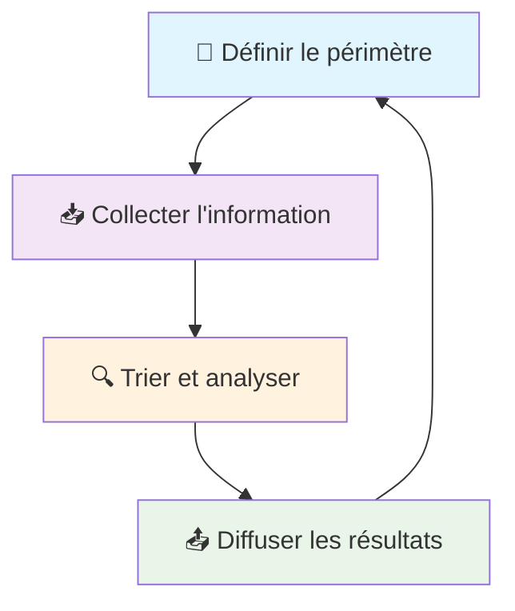


La **veille stratégique** et la **veille citoyenne** partagent des méthodes communes mais poursuivent des objectifs différents : l'une optimise les décisions organisationnelles, l'autre renforce la démocratie participative. Ce dossier examine leurs principes, outils et impacts, avec des exemples concrets de mise en œuvre en Belgique et à l'international.


## 📊 Introduction : Deux facettes de la surveillance informationnelle


L'information maîtrisée est la clé de l'action efficace, qu'elle serve la stratégie d'entreprise ou la vitalité démocratique.


La **veille stratégique** et la **veille citoyenne** désignent des activités de surveillance et d'analyse d'informations dans des contextes distincts mais complémentaires. Tandis que la première éclaire les décisions organisationnelles pour anticiper les évolutions environnementales, la seconde mobilise les citoyens pour surveiller l'action publique et promouvoir la **transparence démocratique**.


- **Comprendre** les concepts fondamentaux et les méthodes de la veille stratégique
- **Explorer** l'adaptation de ces principes à la surveillance citoyenne
- **Analyser** les outils numériques et méthodologies disponibles
- **Évaluer** les impacts démocratiques et les perspectives d'institutionnalisation
- **Illustrer** par des exemples concrets en Belgique et à l'international


---

## 🏢 Qu'est-ce que la veille stratégique ?

### Définition et périmètre


La **veille stratégique** (ou veille informationnelle) constitue une *"activité continue et organisée de collecte et d'analyse d'informations pertinentes pour anticiper les changements à venir"*. Elle vise à permettre aux organisations de *"se tenir au courant des informations stratégiques afin d'anticiper les évolutions et innovations"* de leur environnement.


Cette démarche se caractérise par plusieurs aspects fondamentaux :

#### Caractère permanent et itératif

Contrairement à une recherche ponctuelle, la veille s'inscrit dans la **durée**. Elle suppose :
- Une attention **régulière** aux flux d'information
- Un processus **planifié** et **structuré**
- Une **surveillance continue** plutôt qu'occasionnelle

#### Finalité d'aide à la décision

La veille stratégique constitue un **outil d'aide à la décision** en :
- Collectant des données sur l'environnement organisationnel
- Éclairant les dirigeants dans leurs choix stratégiques
- Accompagnant les **choix stratégiques** et la **prise de décision**



### Types de veille stratégique

La veille se décline en plusieurs catégories selon les sources et contenus surveillés :


- **Brevets** et propriété intellectuelle
- **Publications scientifiques** et recherche
- **Innovations** et nouvelles technologies
- **Salons spécialisés** et conférences



- **Données de marché** et tendances sectorielles
- **Produits concurrents** et stratégies
- **Clients** et segments cibles
- **Partenaires** et écosystème économique



- **Nouvelles lois** et réglementations
- **Jurisprudence** et décisions administratives
- **Normes** et standards sectoriels
- **Politiques publiques** impactantes



- **Articles de presse** et médias audiovisuels
- **Réseaux sociaux** et contenus numériques
- **Opinion publique** et perception
- **Réputation en ligne** et signaux faibles


---

## 🎯 Objectifs et avantages de la veille stratégique

### Anticipation et prospective


L'objectif premier de la veille stratégique est d'**anticiper** les évolutions susceptibles d'affecter l'organisation, permettant de s'y préparer ou d'en tirer parti.


Cette démarche **prospective** vise à :

#### Détecter les signaux faibles
- **Tendances émergentes** dans l'environnement
- **Innovations technologiques** naissantes
- **Changements réglementaires** à l'horizon
- **Opportunités** et **menaces** potentielles

#### Réduire l'incertitude
- Éviter les **événements indésirables**
- Préparer des **réponses proactives**
- Minimiser les **surprises stratégiques**

### Avantages opérationnels concrets


**Gain de temps** dans l'accès à l'information pertinente :
- Flux continu d'**informations actualisées**
- Évitement des recherches d'urgence
- **Veille automatisée** et ciblée



**Identification rapide** des changements :
- **Crises naissantes** et signaux d'alerte
- **Tendances du marché** et évolutions sectorielles
- **Mouvements concurrentiels** stratégiques



**Inspiration** et **légitimation** :
- Benchmarking des **meilleures pratiques**
- **Innovation** par inspiration externe
- **Validation** des orientations stratégiques



Une veille bien conduite aide l'organisation à être plus agile et réactive face aux transformations de son environnement.


---

## 🛠️ Méthodes et outils de la veille stratégique

### Démarche structurée en 4 étapes

La veille stratégique suit un processus **itératif** structuré :

#### 1. Définition du périmètre
- **Thèmes** ou domaines à surveiller
- **Besoins stratégiques** de l'organisation
- **Sources** prioritaires et secondaires

#### 2. Collecte systématique
- **Automatisation** via outils numériques
- **Surveillance** des sources identifiées
- **Agrégation** des informations pertinentes

#### 3. Tri et analyse
- **Filtrage** et hiérarchisation
- **Analyse qualitative** et mise en perspective
- **Détection** des corrélations et signaux

#### 4. Diffusion ciblée
- **Communication** aux décideurs concernés
- **Formats** adaptés aux besoins
- **Actionabilité** des recommandations

### Révolution numérique des outils de veille


L'essor d'Internet a **radicalement transformé** les pratiques de veille depuis les années 1990. La majorité de la veille est désormais **automatisée** grâce aux technologies numériques.


#### Outils automatisés essentiels


- **Abonnements** aux mises à jour de sites web
- **Centralisation** de centaines de sources
- **Filtrage** par mots-clés et catégories
- **Notification** en temps réel



- **Google Alerts** pour mots-clés spécifiques
- **Alertes sectorielles** personnalisées
- **Monitoring** de mentions et signalements
- **Surveillance** de la concurrence



- **Tableaux de bord** personnalisables
- **Datavisualisation** et analyse de tendances
- **Workflows** de validation et diffusion
- **Collaboration** et partage d'équipe


#### Intelligence artificielle et veille


Les **outils d'IA** commencent à s'intégrer dans la veille stratégique :
- **Filtrage intelligent** de l'information
- **Détection automatisée** des signaux faibles
- **Analyse prédictive** des tendances
- **Traitement** de masses de données


### Dimension humaine et collaborative

#### Rôle crucial du veilleur

Malgré l'automatisation, la **compétence humaine** reste essentielle :

- **Analyse qualitative** et mise en perspective
- **Détection** des corrélations complexes
- **Identification** des tentatives de désinformation
- **Interprétation** critique des sources

#### Veille collaborative émergente


- **Plateformes collaboratives** d'entreprise
- **Contribution** multi-services
- **Mutualisation** des observations terrain
- **Intelligence collective** organisationnelle



- **Communautés d'experts** sectoriels
- **Forums spécialisés** et réseaux sociaux
- **Partage** de veille thématique
- **Crowdsourcing** d'information stratégique


---

## 👥 De la veille stratégique à la veille citoyenne

### Adaptation des principes au contexte démocratique


La veille citoyenne constitue *"le regard porté par les citoyens sur la mise en œuvre de l'action publique afin de veiller à ce que les engagements pris soient respectés"*. Elle représente une forme de **surveillance citoyenne** de l'État et des institutions.


Cette démarche transpose les méthodes de veille stratégique vers des objectifs de **participation démocratique** :

#### Objectifs de transparence et redevabilité

La veille citoyenne poursuit des finalités d'**accountability** :
- **Vérification** du respect des promesses électorales
- **Suivi** de l'exécution des politiques publiques
- **Contrôle** de l'utilisation des fonds publics
- **Détection** des manquements et dysfonctionnements


Quand bien même les gouvernements prennent des engagements et mettent en place des stratégies, s'il n'y a pas de suivi, rien n'assure qu'il y aura des résultats.


#### Combler le déficit de suivi démocratique


- **Manque** de surveillance indépendante continue
- **Écart** entre promesses et réalisations
- **Opacité** relative de l'action administrative
- **Besoin** d'information citoyenne accessible


### Exemples pionniers en Belgique

#### Anticor Belgique et les comités transparence

 développe depuis 2017 une stratégie de **comités locaux citoyens** :


*"Seule votre vigilance citoyenne, dans votre ville, peut forcer nos politiciens à être plus transparents"*


**Objectifs des Comités Transparence** :
- Surveillance de la **gestion publique communale**
- Formation de **citoyens vigilants** locaux
- **Interpellation** des élus sur la transparence
- Création d'un **réseau** de surveillance citoyenne

#### Transparencia.be : démocratiser l'accès à l'information

 a été lancée en 2016 comme **plateforme collaborative** facilitant les demandes d'accès aux documents administratifs.

**Fonctionnalités clés** :
- **Centralisation** des demandes d'information publique
- **Publication** des réponses administratives
- **Baromètre** de transparence des institutions
- **Facilitation** des procédures citoyennes


- **Visibilité** des administrations coopératives vs récalcitrantes
- **Pression** sur les entités peu transparentes
- **Rappels à l'ordre** de la Commission d'Accès aux Documents Administratifs
- **Amélioration** proactive de certaines communes


---

## 🔧 Pratiques et outils de la veille citoyenne

### Formes organisationnelles variées

La veille citoyenne se manifeste sous **différentes modalités** :

#### Initiatives individuelles
- **Blogs citoyens** d'analyse des comptes publics
- **Épluçage** individuel des délibérations communales
- **Publication** personnelle de données publiques
- **Interpellation** directe des élus

#### Collectifs et associations structurés
- **ONG** de transparence et good governance
- **Collectifs anticorruption** et surveillance
- **Associations thématiques** (environnement, droits)
- **Groupes citoyens** mobilisés ponctuellement

### Méthodes de collecte d'information

#### Exploitation du droit d'accès


La **loi de 1994** garantit le droit de consultation des documents administratifs (article 32 de la Constitution). Ce principe de **publicité de l'administration** constitue le fondement juridique de la veille citoyenne.


**Sources documentaires accessibles** :
- **Rapports** et études administratives
- **Budgets** détaillés et comptes publics
- **Délibérations** des conseils et exécutifs
- **Marchés publics** et attributions
- **Subventions** et financements accordés

#### Observation directe et enquêtes terrain


- **Avancement** des investissements publics
- **Conformité** aux cahiers des charges
- **Respect** des délais annoncés
- **Impact** environnemental et social



- **Exécution** du budget municipal
- **Écarts** avec les prévisions
- **Dépenses** exceptionnelles ou irrégulières
- **Endettement** et gestion financière


### Outils numériques spécialisés

#### Plateformes de crowdsourcing


Développée au Kenya en 2008, **Ushahidi** permet le *crowdmapping* participatif :
- **Collecte** de témoignages citoyens par SMS/Internet
- **Cartographie** en temps réel des incidents
- **Agrégation** d'une "mémoire vivante" d'événements
- Constitution d'un **contre-pouvoir citoyen** documenté


**Applications possibles** :
- Surveillance **électorale** et signalement de fraudes
- Cartographie des **nuisances** environnementales
- Monitoring de **crises** humanitaires
- Suivi de **services publics** locaux

#### Exploitation de l'Open Data


Le mouvement **Open Data** fournit des ressources essentielles :
- **Budgets détaillés** en formats exploitables
- **Indicateurs** de performance publique
- **Registres** administratifs consultables
- **Données** géolocalisées et temporelles



L'open data est perçu comme un **outil de contre-pouvoir citoyen** permettant l'analyse indépendante des politiques publiques et la détection d'incohérences ou d'irrégularités.


#### Réseaux sociaux et communication

**Double fonction** des plateformes numériques :
1. **Source d'information** (signalements, fuites, alertes)
2. **Canal de diffusion** (sensibilisation, mobilisation, interpellation)

**Dynamiques observées** :
- **Groupes Facebook** de surveillance municipale
- **Fils Twitter** d'interpellation d'élus
- **Cellules** de veille participative locale
- **Campagnes** de sensibilisation thématique

---

## 📈 Exemples internationaux de veille citoyenne

### Cas d'étude : Le Présimètre burkinabé

 constitue un exemple innovant de **surveillance citoyenne institutionnalisée**.


- **Suivi** de l'exécution des promesses présidentielles
- **Notation** du taux d'avancement par secteur
- **Commentaires** et évaluations citoyennes
- **Tableaux de bord** interactifs et accessibles


**Objectifs affichés** :
- *"Consolider la culture démocratique"*
- *"Institutionnaliser le suivi citoyen de l'action publique"*
- *"Renforcer l'imputabilité politique et la redevabilité socio-économique"*

#### Impact et enseignements


Le Présimètre démontre la faisabilité du **suivi citoyen à grande échelle** via les TIC, créant une pression constructive sur les gouvernants pour tenir leurs engagements.


### Innovation française : observatoires citoyens municipaux

#### Castanet-Tolosan : Observatoire Citoyen des Comptes Publics


- **Création** par la municipalité comme instance de participation
- **Mission** de renforcement de la transparence budgétaire
- **Composition** mixte élus-citoyens
- **Rapports** publics et recommandations


#### Malakoff : Observatoire des engagements municipaux

**Fonctionnement** :
- **Suivi** de l'état d'avancement des promesses de campagne
- **Évaluation** périodique des réalisations
- **Publication** de bilans intermédiaires
- **Interface** entre citoyens et exécutif municipal


Ces exemples montrent que la veille citoyenne peut être exercée **en collaboration** avec les autorités locales, intégrée aux dispositifs participatifs de gouvernance.


### Belgique : l'écosystème Cumuleo

 représente une initiative de **transparence citoyenne** d'envergure nationale.

#### Fonctionnalités et données

**Périmètre de surveillance** :
- **33 000+ mandataires** politiques belges
- **Mandats, fonctions et rémunérations** détaillés
- **Détection** des cumuls et conflits d'intérêts
- **Historique** des parcours politiques

#### Reconnaissance institutionnelle


L'Autorité de protection des données belge a confirmé le droit de Cumuleo de publier les rémunérations des élus, reconnaissant son *"rôle comparable à celui de la presse dans le débat d'intérêt public sur la transparence et la lutte contre la corruption"*.


Cette reconnaissance illustre la **légitimité croissante** de la veille citoyenne comme composante du contrôle démocratique.

---

## 🌱 Encourager et institutionnaliser la veille citoyenne

### Leviers d'encouragement

#### Facilitation de l'accès à l'information


**Obligations publiques** :
- Adoption de **lois** garantissant le droit à l'information
- Mise en place de **portails** open data accessibles
- **Publication** proactive d'informations sensibles
- **Formats** exploitables et standards ouverts

**Réduction des coûts d'entrée** :
- Simplification des **procédures** de demande
- **Délais** de réponse raccourcis
- **Gratuité** de l'accès aux données essentielles


#### Formation et outillage des citoyens


Des initiatives de **formation civique pratique** peuvent stimuler la participation en développant les compétences nécessaires à la veille citoyenne efficace.


**Domaines de formation** :
- **Lecture** et analyse de budgets publics
- **Procédures** d'accès aux documents administratifs
- **Vérification** d'information et fact-checking
- **Outils** numériques de veille et analyse

#### Soutien aux initiatives de la société civile


**Formes de soutien** :
- **Subventions** aux plateformes citoyennes de transparence
- **Mise à disposition** de salles et matériel pour comités locaux
- **Reconnaissance symbolique** de l'utilité sociale
- **Dialogue** institutionnel avec les organisations vigilantes


### Voies d'institutionnalisation

#### Intégration aux processus décisionnels


**Modalités** :
- **Association** de citoyens tirés au sort aux organes de contrôle
- **Commissions** mixtes élus-citoyens pour l'évaluation des politiques
- **Droit** de regard citoyen sur la gestion financière
- **Pouvoir** consultatif formalisé


#### Cadre légal de reconnaissance

**Exemples internationaux** :
- **Burkina Faso** : Comités de veille et de développement (COVED) institués par loi (2023)
- **Participation** citoyenne formalisée dans chaque commune
- **Mission** de suivi des projets de développement
- **Remontée** officielle des préoccupations du terrain

#### Programmes de gouvernement ouvert


La Belgique participe au mouvement international du **PGO** (Partenariat pour un Gouvernement Ouvert) promouvant :
- **Transparence** et open data
- **Participation** citoyenne structurée
- **Collaboration** avec la société civile
- **Redevabilité** renforcée des institutions


### Changement culturel nécessaire

#### Valorisation du citoyen vigilant


Reconnaître la légitimité du regard citoyen, c'est admettre que n'importe quel citoyen peut contribuer à l'évaluation des politiques publiques et à l'amélioration de la gouvernance.


**Évolution des mentalités** :
- Passage du **citoyen passif** au **citoyen proactif**
- **Complémentarité** entre contrôles institutionnels et citoyens
- **Normalisation** de la surveillance démocratique continue
- **Célébration** des exemples positifs de veille citoyenne

#### Communication et exemplarité


**Campagnes de sensibilisation** :
- **Mise en avant** d'exemples positifs d'amélioration
- **Témoignages** de citoyens engagés efficacement
- **Démonstration** de l'impact concret de la veille
- **Formation** aux bonnes pratiques démocratiques


---

## 🏛️ Impact démocratique de la veille citoyenne

### Renforcement de la transparence

#### Stimulation proactive de l'ouverture


La simple **existence** d'une surveillance citoyenne incite les autorités à publier davantage d'informations de leur propre initiative, créant une **dynamique vertueuse** de transparence.


**Mécanismes observés** :
- **Anticipation** des demandes citoyennes par publication proactive
- **Évitement** des accusations d'opacité
- **Standardisation** de la communication publique
- **Amélioration** des interfaces citoyens

#### Pédagogie démocratique

La veille citoyenne contribue à rendre l'action publique **compréhensible** :
- **Vulgarisation** de documents techniques (budgets, rapports)
- **Synthèses** visuelles et accessibles
- **Médiation** entre administration et citoyens
- **Éducation** civique pratique


**Transformation de l'information** :
- Budget communal brut (500 pages, illisible) →
- Synthèse citoyenne (infographie, 2 pages) →
- Débat public éclairé et questions précises


### Responsabilisation des institutions (Accountability)

#### Contrôle populaire continu


La veille citoyenne crée un **mécanisme informel mais puissant** de contrôle populaire, rappelant aux élus qu'ils sont sous le regard permanent de la société.


**Effets de la surveillance** :
- **Documentation** des réussites et manquements
- **Exposition publique** des dysfonctionnements
- **Pression** pour des correctifs rapides
- **Sanctions sociales** en cas d'opacité

#### Reddition de comptes en continu


**Avantages** :
- **Évaluation** permanente de l'action publique
- **Interpellation** directe sur les décisions controversées
- **Suivi** des promesses électorales en temps réel
- **Ajustement** possible des politiques en cours


### Démocratie participative renforcée

#### Implication active des citoyens

La veille citoyenne **complète** la démocratie participative :
- **Amont** : consultation sur les projets
- **Pendant** : co-construction des politiques  
- **Aval** : **surveillance** de la mise en œuvre


Participer ne signifie pas seulement donner son avis, mais aussi suivre la mise en œuvre et s'assurer que la décision produit les effets escomptés.


#### Feedback et amélioration continue

**Boucle de rétroaction** :
1. **Observation** citoyenne des politiques
2. **Signalement** des dysfonctionnements
3. **Interpellation** des responsables
4. **Ajustement** des actions publiques
5. **Évaluation** de l'amélioration

#### Développement des compétences civiques


**Effets individuels** :
- **Acquisition** de connaissances pointues sur les enjeux
- **Développement** de l'esprit critique
- **Renforcement** du sentiment d'efficacité politique
- **Maîtrise** des dossiers complexes

**Effets collectifs** :
- **Culture démocratique** renforcée
- **Citoyens** plus aguerris et informés
- **Dialogue** d'égal à égal avec les autorités
- **Participation** qualifiée aux débats publics


### Émergence d'un contre-pouvoir citoyen

#### Cinquième pouvoir démocratique


La veille citoyenne constitue un **contre-pouvoir diffus** exercé par le peuple lui-même, s'ajoutant aux mécanismes traditionnels de séparation des pouvoirs et de contrôle démocratique.


**Caractéristiques distinctives** :
- **Indépendance** vis-à-vis des institutions
- **Multiplicité** et dispersion des acteurs
- **Difficulté** à museler ou intimider
- **Légitimité** populaire directe

#### Rééquilibrage démocratique


**Mécanismes d'influence** :
- **Révélation** d'informations que l'administration préférait taire
- **Changement** de l'agenda politique par la pression publique
- **Contre-narration** face aux versions officielles
- **Mobilisation** de l'opinion sur des enjeux négligés


#### Filet de sécurité démocratique


Si tous les mécanismes formels de contrôle venaient à faillir, il resterait ce dernier rempart qu'est l'opinion publique active et vigilante.


**Résistance aux dérives** :
- **Surveillance** décentralisée et multiple
- **Alerte** en cas de dysfonctionnements institutionnels
- **Maintien** de la pression démocratique
- **Protection** contre l'autoritarisme rampant

### Renouvellement de la confiance démocratique

#### Alternative à l'impuissance citoyenne


La veille citoyenne **démontre** que les citoyens peuvent avoir une influence réelle en dehors des périodes électorales, réduisant le sentiment d'impuissance face au système politique.


**Cercle vertueux** :
- **Exemples** de citoyens efficaces → **Inspiration** d'autres → **Multiplication** des initiatives → **Impact** visible → **Renforcement** de la confiance

#### Démocratie mature et équilibrée

**Vision d'ensemble** :
- **Circulation fluide** du pouvoir entre représentants et société
- **Contrôle** permanent plutôt qu'épisodique
- **Collaboration** constructive public-privé
- **Équilibre** entre efficacité et transparence

---

## 🔮 Perspectives et défis futurs

### Enjeux technologiques

#### Intelligence artificielle et veille citoyenne


Les technologies d'**intelligence artificielle** ouvrent de nouvelles possibilités pour la veille citoyenne :
- **Analyse automatisée** de masses de documents publics
- **Détection** de patterns et anomalies budgétaires
- **Alerte** sur les écarts entre promesses et réalisations
- **Synthèse** intelligente d'informations complexes


**Défis à anticiper** :
- **Fracture numérique** et accès inégal aux outils
- **Biais algorithmiques** dans l'analyse automatisée
- **Désinformation** et manipulation des données
- **Protection** de la vie privée et données personnelles

#### Blockchain et traçabilité démocratique


- **Traçabilité** immuable des décisions publiques
- **Vote** électronique sécurisé et vérifiable
- **Transparence** des financements politiques
- **Audit** permanent et automatisé des institutions


### Défis organisationnels

#### Professionnalisation vs. spontanéité


Comment **institutionnaliser** la veille citoyenne sans la **dénaturer** ? L'équilibre entre efficacité organisée et spontanéité démocratique reste à trouver.


**Questions en débat** :
- **Financement** public des initiatives citoyennes : risque de récupération ?
- **Formation** des citoyens veilleurs : standardisation vs. diversité ?
- **Coordination** des efforts : centralisation vs. autonomie ?

#### Passage à l'échelle


**Obstacles identifiés** :
- **Surcharge informationnelle** des citoyens
- **Complexité** croissante des enjeux techniques
- **Temps** nécessaire à une veille de qualité
- **Découragement** face à l'ampleur des dysfonctionnements


### Risques et limites

#### Instrumentalisation politique


La veille citoyenne peut être **instrumentalisée** par des groupes d'intérêts ou des partis politiques pour déstabiliser des adversaires plutôt que pour améliorer la gouvernance.


**Garde-fous indispensables** :
- **Transparence** sur les financements des initiatives
- **Pluralisme** des sources et points de vue
- **Fact-checking** rigoureux des informations diffusées
- **Éthique** de la surveillance démocratique

#### Fatigue démocratique


- **Multiplication** des alertes et signalements
- **Complexification** de l'information citoyenne
- **Désengagement** par découragement
- **Polarisation** des débats publics


---

## 📚 Ressources et outils pratiques

### Guides méthodologiques

#### Pour démarrer une veille citoyenne locale


1. **Identifier** un enjeu local prioritaire
2. **Rassembler** un noyau de citoyens motivés
3. **Former** aux techniques de veille et d'analyse
4. **Établir** une stratégie de communication
5. **Développer** des partenariats avec médias locaux
6. **Maintenir** la motivation sur la durée


#### Outils indispensables







### Formations disponibles

#### Éducation civique pratique


- **Ateliers** de lecture de budgets communaux
- **Stages** d'introduction au droit administratif
- **Formation** aux outils de fact-checking
- **Modules** de communication et plaidoyer


#### Ressources en ligne

**Guides pratiques** :
- Manuel de la veille citoyenne (PDF à télécharger)
- Tutoriels vidéo d'utilisation des outils
- Webinaires thématiques mensuels
- Forum d'entraide entre citoyens veilleurs

---

## 🎯 Conclusion : Vers une démocratie vigilante

### Synthèse des apports

La **veille stratégique** et la **veille citoyenne**, bien que poursuivant des objectifs différents, partagent une conviction fondamentale : **l'information maîtrisée est la clé de l'action efficace**. Dans le domaine organisationnel, elle assure la pérennité et la compétitivité. Dans le domaine démocratique, elle garantit la vitalité et la probité des institutions.


La veille citoyenne n'est finalement rien d'autre que l'expression moderne de la vieille maxime : "Le prix de la liberté, c'est la vigilance éternelle des citoyens".


### Conditions de réussite

#### Triptyque fondamental


1. **Transparence** : accès facilité à l'information publique
2. **Capacitation** : formation et outillage des citoyens
3. **Institutionnalisation** : reconnaissance et soutien des initiatives


#### Écosystème favorable

Pour que la veille citoyenne se développe pleinement, il convient de :
- La **soutenir** sans la récupérer politiquement
- L'**encadrer** intelligemment sans la bureaucratiser
- En faire une **composante naturelle** de nos institutions démocratiques

### Vision prospective

#### Démocratie participative intégrée


**Évolution souhaitée** :
- **Normalisation** de la surveillance citoyenne continue
- **Complémentarité** efficace entre représentation et participation
- **Outils numériques** démocratiques généralisés
- **Culture** de la transparence et du dialogue


#### Impact sur la gouvernance

La veille citoyenne contribue à l'émergence d'une **gouvernance plus ouverte** où :
- L'information circule **librement**
- Les citoyens sont des **acteurs** plutôt que des spectateurs
- La **collaboration** public-privé s'épanouit
- Le **contrôle démocratique** s'exerce en permanence

### Appel à l'engagement


En Belgique comme ailleurs, cette vigilance démocratique est **à la portée de chacun**. Son exercice représente une chance pour la démocratie et un devoir civique dans une société libre.


**Première étape** : Identifier un enjeu local qui vous préoccupe et commencer à vous informer systématiquement sur sa prise en charge par les autorités compétentes.

**Deuxième étape** : Partager vos découvertes avec d'autres citoyens et construire progressivement une démarche collective de surveillance bienveillante.

**Troisième étape** : Entrer en dialogue constructif avec les responsables publics pour améliorer concrètement la situation observée.


La démocratie ne s'arrête pas au vote : elle se prolonge par une participation active et une vigilance de chaque instant, exercées par et pour les citoyens.


---

## 📖 Sources et références


Les informations présentées dans ce dossier proviennent de **sources fiables et variées** : publications spécialisées, travaux académiques, rapports d'ONG, initiatives de la société civile, sites officiels et sources journalistiques. Toutes les références sont **vérifiables** et **actualisées** pour refléter l'état de la pratique en 2025.


### Sources principales

#### Définitions et cadrage théorique

1. **Wikipédia** - Veille stratégique : définitions, méthodes et évolution historique
   

2. **Archimag** - Magazine spécialisé en veille et intelligence économique
   

#### Veille citoyenne et participation

3. **Gret** - *La participation citoyenne* (Rapport 2021)
   

4. **Anticor Belgique** - Association de lutte contre la corruption
   

5. **Transparencia.be** - Plateforme d'accès aux documents publics
   

#### Exemples internationaux

6. **Présimètre Burkina Faso** - Plateforme de suivi présidentiel
   

7. **Cumuleo.be** - Baromètre des mandats politiques belges
   

8. **Ville de Castanet-Tolosan** - Observatoire citoyen des comptes publics
   

#### Recherche académique et prospective

9. **Samuel Goëta** - *Les données de la démocratie : open data, pouvoirs et contre-pouvoirs* (2024)
   

10. **Datactivist** - Guide des bonnes pratiques de suivi citoyen
    

### Sources réglementaires

#### Cadre légal belge

- **Constitution belge** - Article 32 (publicité de l'administration)
- **Loi du 11 avril 1994** - Relative à la publicité de l'administration
- **Décisions CADA** - Commission d'Accès aux Documents Administratifs

#### Cadre international

- **Partenariat pour un Gouvernement Ouvert (PGO)** - Engagements belges
- **Loi burkinabé n°003-2023/ALT** - Institution des Comités de veille et de développement
  

### Outils et plateformes

#### Techniques de veille

- **Google Alerts** - Surveillance automatisée par mots-clés
- **Flux RSS** - Agrégation de sources d'information
- **Ushahidi** - Plateforme de crowdmapping participatif

#### Open Data et transparence

- **Data.gov.be** - Portail officiel des données ouvertes belges
- **OpenStreetMap** - Cartographie collaborative libre
- **GitHub** - Hébergement de projets citoyens open source

---


Cette ressource constitue un **point de départ** pour comprendre et pratiquer la veille citoyenne. N'hésitez pas à consulter les sources référencées pour approfondir les aspects qui vous intéressent le plus, et surtout à **passer à l'action** dans votre contexte local !



- Civic tech, gouvernement ouvert, e-participation
- Accountability, redevabilité, transparence publique  
- Crowdsourcing, intelligence collective, démocratie numérique
- Fact-checking, vérification citoyenne, contre-pouvoir
- Budget participatif, consultation publique, co-construction


---

*Dernière mise à jour : Janvier 2025 | Document évolutif sous licence Creative Commons*